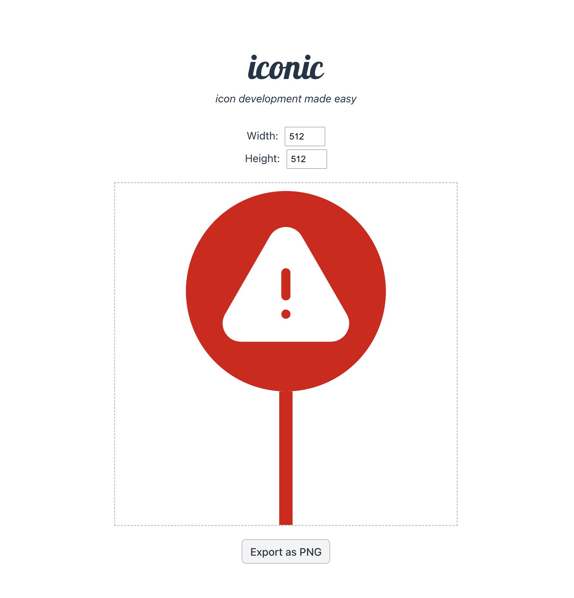

# 🖼️ React Component to PNG Utility

A simple, ready-to-use React application designed for quickly prototyping and exporting single components as high-resolution PNG images. Perfect for generating icons, map markers, or small visual assets of variable, user defined size directly from JSX/CSS.

---

## ✨ Features

- **Defined Canvas:** Develop your component within a predefined, constrained space, ensuring consistency for icon generation.
- **One-Click PNG Export:** Utilizes the **`html-to-image`** library to accurately capture the rendered component and download it as a PNG file.
- **Isolated Development:** All core logic is pre-wired, allowing developers to focus purely on the component's design in a single file.
- **Fast Development Server:** Get up and running immediately with a standard Vite/React development setup.

## Example



---

## 🚀 Getting Started

These instructions will get a copy of the project up and running on your local machine for development and testing purposes.

### Prerequisites

You need to have **Node.js** and **npm** (or Yarn/pnpm) installed on your system.

### Installation

1.  **Clone the repository:**

    ```bash
    git clone git@github.com:nverjinski/iconic.git
    cd iconic
    ```

2.  **Install dependencies:**

    ```bash
    npm install
    # or
    # yarn install
    ```

3.  **Start the development server:**
    ```bash
    npm run dev
    ```
    The application will typically be available at `http://localhost:5173` (or the next available port).

---

## 🔧 Usage

The entire application is set up to focus development on a single file: **`IconComponent.jsx`**.

1.  **Open the project** in your code editor.
2.  Navigate to the designated component file (e.g., `src/IconComponent/IconComponent.jsx`).
3.  **Define your component** within this file. The component will automatically render inside the fixed container in the browser.
4.  You can use styled-components, inline styles, or the provided `IconComponent.css` file to style your icon.

    ```jsx
    // src/IconComponent.jsx

    const IconComponent = () => {
      return (
        <div
          style={{
            width: "100%",
            height: "100%",
            display: "flex",
            alignItems: "center",
            justifyContent: "center",
            backgroundColor: "#38bdf8",
          }}
        >
          <h1 style={{ color: "white", fontSize: "100px" }}>R</h1>
        </div>
      );
    };

    export default IconComponent;
    ```

5.  When you are satisfied with the visual result, click the **"Download PNG"** button in the browser to save the component as a PNG file.

---

## ⚙️ Core Technology

This utility relies on the following key packages:

- **React:** Frontend library for building the user interface.
- **`html-to-image`**: A library that uses HTML5 canvas and SVG to generate an image (PNG in this case) from a DOM node. This is the core functionality enabling the download feature.
- **Vite:** Used for the fast development environment and bundling.

---

## 🤝 Contributing

Contributions are welcome! If you have suggestions for improvements, such as adding more export formats (JPEG, SVG) or advanced component controls (color pickers, size toggles), please feel free to submit a pull request or open an issue.

---

## 📄 License

This project is licensed under the **[MIT License]** - see the `LICENSE.txt` file for details.

---

## 🙏 Acknowledgments

- Built with **React** and **Vite**.
- The image export functionality is powered by the excellent **`html-to-image`** library.
